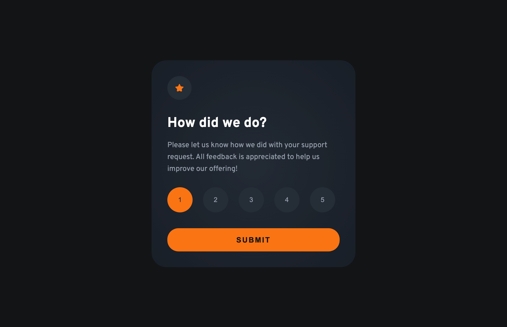

# Frontend Mentor - Interactive rating component solution

This is a solution to the [Interactive rating component challenge on Frontend Mentor](https://www.frontendmentor.io/challenges/interactive-rating-component-koxpeBUmI). Frontend Mentor challenges help you improve your coding skills by building realistic projects.

## Table of contents

- [Overview](#overview)
  - [The challenge](#the-challenge)
  - [Screenshot](#screenshot)
  - [Links](#links)
- [My process](#my-process)
  - [Built with](#built-with)
  - [What I learned](#what-i-learned)
  - [Continued development](#continued-development)
- [Author](#author)

## Overview

### The challenge

Users should be able to:

- View the optimal layout for the app depending on their device's screen size
- See hover states for all interactive elements on the page
- Select and submit a number rating
- See the "Thank you" card state after submitting a rating

### Screenshot



### Links

- Solution URL: [Frontend Mentor Solution](https://www.frontendmentor.io/solutions/interactive-rating-component-zD2e8ncf0A)
- Live Site URL: [Live site at Netlify](https://animated-pothos-66660f.netlify.app/)

## My process

### Built with

- Semantic HTML5 markup
- CSS custom properties
- Flexbox

### What I learned

While working through this project i learned how to prevent mutiple buttons from being selected before selecting submit, and also the importance of making sure that the submit button is not disabled before submitting the selected button rating.

```js
ratingBtns.forEach((btn) => btn.classList.remove('selected'));

submitBtn.disabled = false;
```

### Continued development

I would like continue learnign about Javascript Form Validation.

## Author

- Frontend Mentor - [@JGedd](https://www.frontendmentor.io/profile/JGedd)
